  <picture>
    <source media="(prefers-color-scheme: dark)" srcset="./dark.svg">
    <source media="(prefers-color-scheme: light)" srcset="./light.svg">
    <!-- Varsayılan olarak dark mode SVG gösterilir -->
    
  </picture>

